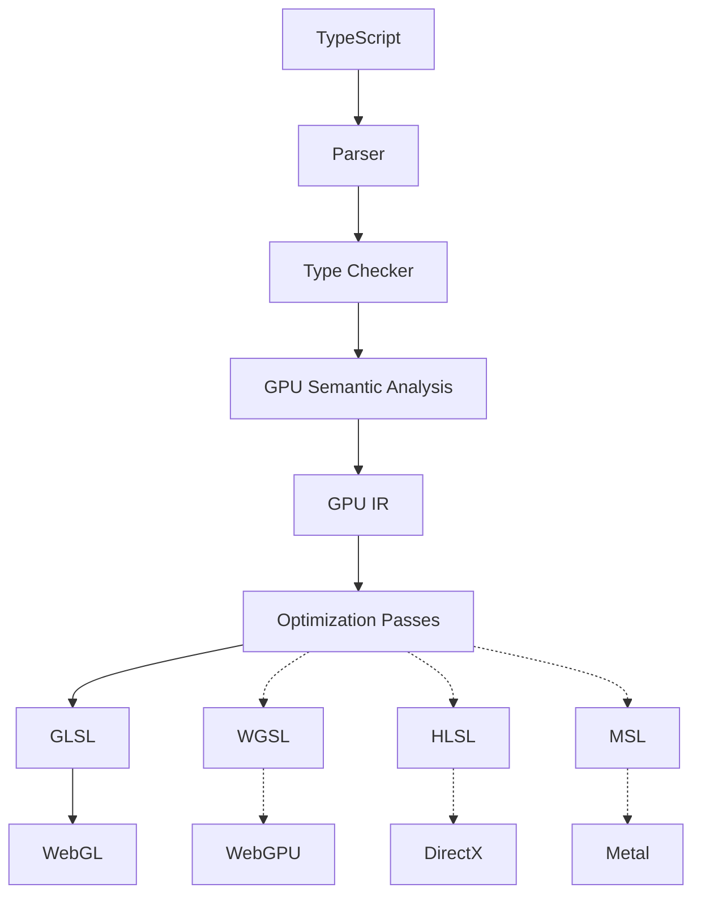

# BroMetal

Write TypeScript.  Lift Shaders.  Skip leg day.

BroMetal is LLVM-inspired compiler infrastructure for GPU programming that transforms TypeScript into highly optimized GPU shaders. Today it compiles a typed TypeScript DSL to WebGL2 GLSL (ES 3.00) and ships the WebGL runtime to go with it — buffers, uniforms, program linking, and the render loop are all handled for you.



Solid lines are implemented; dotted backends are the roadmap.

## Quick start

Write a shader as plain TypeScript in a `*.shader.ts` file:

```ts
// src/shaders/cube.shader.ts
import { shader, vec4 } from 'brometal';

export default shader({
  attributes: { aPosition: 'vec3', aColor: 'vec3' },
  uniforms: { uMvp: 'mat4' },
  varyings: { vColor: 'vec3' },

  vertex({ aPosition, aColor }, { uMvp }, v) {
    v.vColor = aColor;
    return uMvp.mul(vec4(aPosition, 1));
  },

  fragment(_uniforms, { vColor }) {
    return vec4(vColor, 1);
  },
});
```

Compile it:

```bash
npx brometal dev    # compile all *.shader.ts and watch for changes
npx brometal prod   # one-shot optimized build (constant folding + minified GLSL)
```

Each `name.shader.ts` compiles to a sibling `name.shader.gen.ts` — a dependency-free module containing the GLSL plus typed interface metadata. Your app imports the generated module and never bundles the compiler:

```ts
import { createRenderer, createProgram, mat4 } from 'brometal';
import cubeShader from './shaders/cube.shader.gen';

const renderer = createRenderer(canvas);
const program = createProgram(renderer.gl, cubeShader);

program.attributes.aPosition.set(positions);   // Float32Array
program.attributes.aColor.set(colors);
program.setIndices(indices);

renderer.loop((t) => {
  program.uniforms.uMvp.set(mat4.multiply(projection, mat4.multiply(view, mat4.rotationY(t))));
  program.draw();
});
```

Everything is typed end-to-end: the attribute/uniform records in `shader()` drive the GLSL declarations, the generated metadata, and the `program.attributes.*` / `program.uniforms.*` accessors — a typo'd uniform name is a compile error in your app, and the compiler enforces the varyings contract (vertex must write every varying) with `file:line:col` diagnostics.

## Instancing

Declare per-instance inputs with `instanceAttributes` — they upload to the GPU once and advance per instance, not per vertex:

```ts
export default shader({
  attributes: { aPosition: 'vec3', aColor: 'vec3' },
  instanceAttributes: { iOffset: 'vec3', iAxis: 'vec3', iSpeed: 'float' },
  uniforms: { uViewProj: 'mat4', uTime: 'float' },
  // vertex() receives attributes and instance attributes together
});
```

When a shader declares instance attributes, `program.draw()` automatically uses instanced rendering. The `examples/instanced-cubes` demo renders 1,000 independently tumbling cubes in **one draw call** — each cube's rotation is computed in the vertex shader from a single `uTime` float, so the per-frame CPU→GPU traffic is one mat4 and one float, total.

## Examples

```bash
npm install
npm run build                # build the brometal package
npm run dev:rotating-cube    # rotating cube      → http://localhost:5173
npm run dev:instanced-cubes  # 1,000 cubes demo   → http://localhost:5174
```

To iterate on an example's shader, run `npm run shaders:watch` in its directory alongside vite — regenerated modules hot-reload automatically.

## What the DSL supports (MVP)

- Types: `float`, `vec2`, `vec3`, `vec4`, `mat4` (uniforms only for `mat4`)
- Per-vertex `attributes` and per-instance `instanceAttributes`
- `const` locals, float arithmetic (`+ - * /`), comparisons, `if`/`else`
- Vector methods `.add() .sub() .mul() .div() .scale()`, `mat4.mul()`, swizzles (`.x`, `.xyz`, …)
- Constructors `vec2/vec3/vec4` (composite forms like `vec4(v3, 1)` included)
- Intrinsics: `normalize dot cross mix clamp length sin cos abs fract floor sqrt pow min max`

Anything outside the subset fails compilation with a precise, actionable error.

## Repo layout

```
packages/brometal/       # the npm package: compiler, CLI, WebGL2 runtime, mat4 math
examples/rotating-cube   # hello-world: one spinning cube
examples/instanced-cubes # 1,000 GPU-animated cubes in a single draw call
```

## Development

```bash
npm run build       # compile the package (tsc)
npm test            # vitest: compiler goldens, analyzer errors, optimizer, math, CLI
npm run typecheck   # strict tsc across package + example
```
