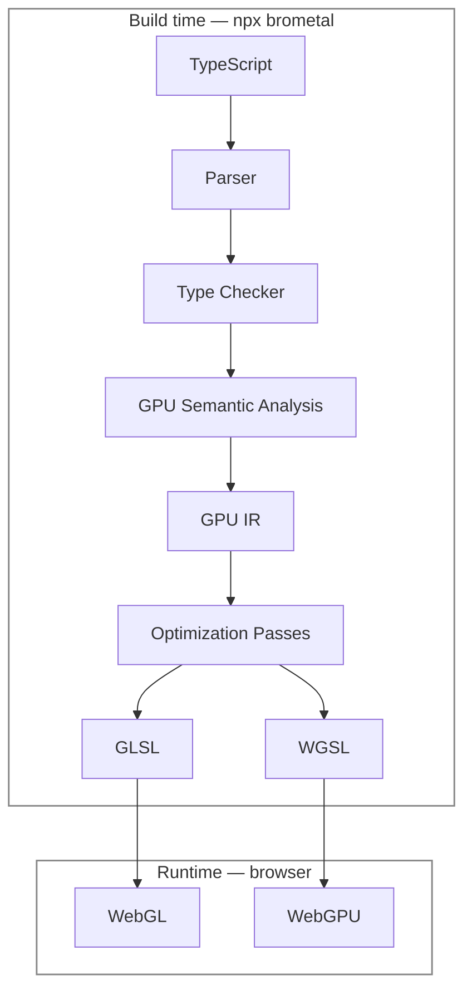

# BroMetal

Write TypeScript.  Lift Shaders.  Ship Shredded.

BroMetal is LLVM-inspired compiler infrastructure for GPU programming that transforms TypeScript into highly optimized GPU shaders. It compiles a typed TypeScript DSL to WebGL2 GLSL **and** WGSL, and ships dual WebGL2/WebGPU runtimes to go with it — buffers, uniforms, program linking, and the render loop are all handled for you.

> **Pre-1.0:** BroMetal is evolving fast. Minor versions may include breaking changes — every one is documented in [CHANGELOG.md](CHANGELOG.md). The `shader()` DSL and `brometal/shader-functions` surfaces are stable-by-intent; runtime APIs may still shift until 1.0.



Everything above the line happens once, on your machine — the browser receives finished shader text and a ~10KB runtime, never the compiler.

## WebGPU + WebGL from one source

Every shader compiles to **both** GLSL ES 3.00 and WGSL by default (`npx brometal dev --targets=webgl2,webgpu` to control it — shader text is tiny, so shipping both costs single-digit KB). At runtime:

```ts
const renderer = await createRenderer(canvas);          // WebGPU when available, WebGL2 otherwise
const program = createProgram(renderer, cubeShader);    // same API on both backends
// transparency: createProgram(renderer, s, { blend: 'alpha' | 'additive' })
```

`createRenderer` probes for a working WebGPU adapter and falls back to WebGL2 — same typed program API, same draw loop, no app changes. Pass `backend: 'webgl2' | 'webgpu'` to pin one. The compiler handles the platform differences: WGSL uniform blocks with correct alignment offsets, texture/sampler binding pairs, and the GL→WebGPU clip-space remap are all baked in at build time, so CPU-side matrices work identically on both.

## Quick start

Write a shader as plain TypeScript in a `*.shader.ts` file:

```ts
// src/shaders/cube.shader.ts
import { shader, vec4 } from 'brometal';

export default shader({
  attributes: { aPosition: 'vec3', aColor: 'vec3' },
  uniforms: { uMvp: 'mat4' },
  varyings: { vColor: 'vec3' },

  vertex({ aPosition, aColor }, { uMvp }, v) {
    v.vColor = aColor;
    return uMvp.mul(vec4(aPosition, 1));
  },

  fragment(_uniforms, { vColor }) {
    return vec4(vColor, 1);
  },
});
```

Compile it:

```bash
npx brometal dev    # compile all *.shader.ts and watch for changes
npx brometal prod   # one-shot optimized build (constant folding + minified GLSL)
```

Each `name.shader.ts` compiles to a sibling `name.shader.gen.ts` — a dependency-free module containing the GLSL plus typed interface metadata. Your app imports the generated module and never bundles the compiler:

```ts
import { createRenderer, createProgram, mat4 } from 'brometal';
import cubeShader from './shaders/cube.shader.gen';

const renderer = await createRenderer(canvas);   // WebGPU when available, WebGL2 otherwise
const program = createProgram(renderer, cubeShader);

program.attributes.aPosition.set(positions);   // Float32Array
program.attributes.aColor.set(colors);
program.setIndices(indices);

renderer.loop((t) => {
  program.uniforms.uMvp.set(mat4.multiply(projection, mat4.multiply(view, mat4.rotationY(t))));
  program.draw();
});
```

Everything is typed end-to-end: the attribute/uniform records in `shader()` drive the GLSL declarations, the generated metadata, and the `program.attributes.*` / `program.uniforms.*` accessors — a typo'd uniform name is a compile error in your app, and the compiler enforces the varyings contract (vertex must write every varying) with `file:line:col` diagnostics.

## Camera

`createCamera` gives you a positionable, rotatable camera that compiles down to a single `mat4` uniform:

```ts
const camera = createCamera({ position: [0, 0, 6] });
camera.setPosition(x, y, z);
camera.setRotation(rx, ry, rz);   // radians, applied yaw (Y) → pitch (X) → roll (Z)
camera.lookAt(x, y, z);              // aim at a world position
camera.setLens({ fovY, near, far });

renderer.loop(() => {
  program.uniforms.uViewProj.set(camera.viewProjection(aspect));
  program.draw();
});
```

The view-projection matrix is cached against position, rotation, lens, and aspect — an unmoved camera costs zero matrix math per frame, and nothing allocates. The GPU sees one mat4 regardless of how the camera moves; all per-vertex transformation stays in the shader.

## Geometries

The classic parametric shapes ship built in, each producing positions, normals, UVs, and indices ready for the runtime:

```ts
import { createCube, createSphere, createTorusKnot } from 'brometal';

const sphere = createSphere({ radius: 1.3, widthSegments: 32, heightSegments: 16 });
program.attributes.aPosition.set(sphere.positions);
program.attributes.aNormal.set(sphere.normals);
program.attributes.aUv.set(sphere.uvs);
program.setIndices(sphere.indices);
```

Available: `createCube`, `createSphere`, `createPlane`, `createCylinder`, `createCone`, `createTorus`, `createTorusKnot`, `createCircle`, `createRing` — Three.js-style parameters, CCW winding validated by tests, automatic 16/32-bit index selection.

## Prebuilt shaders

`brometal/shaders` ships 30 complete, ready-to-draw shaders — fire, caustics, domain warp, a raymarched scene, CRT/glitch/halftone image effects, and more — precompiled at package build time. Zero shader compilation happens in your app:

```ts
import { createRenderer, createProgram, createPlane } from 'brometal';
import { fireShader } from 'brometal/shaders';

const renderer = await createRenderer(canvas);
const program = createProgram(renderer, fireShader);
// set a fullscreen quad + uTime/uAspect per frame — that's it
```

Every prebuilt targets a fullscreen quad (`aPosition`/`aUv` from `createPlane({ width: 2, height: 2 })`) with `uTime`/`uAspect` uniforms; image effects add a `uTex` sampler.

## Shader functions

`brometal/shader-functions` ships a curated library of typed GPU functions — noise, hash, easing, color, lighting, and 2D SDFs — that inline into your shader at build time. Import them like any TypeScript function:

```ts
import { shader, vec2, vec3, vec4 } from 'brometal';
import { fbm2, cosinePalette } from 'brometal/shader-functions';

export default shader({
  // ...
  fragment({ uTime }, { vUv }) {
    const n = fbm2(vUv.scale(4).add(vec2(uTime, 0)), 5);
    return vec4(cosinePalette(n, a, b, c, d), 1);
  },
});
```

The compiler resolves imports (and their dependencies — `fbm2` pulls in `vnoise2` and `hash21` automatically), type-checks every call against the library signatures, and emits only the functions each stage actually uses — into both GLSL and WGSL. Nothing ships at runtime; it's tree-shaken shader text.

Included: `hash11 hash21 hash22 hash31` · `vnoise2 gnoise2 fbm2 turbulence2 warp2 voronoi2 worleyEdge2 curl2 vnoise3 fbm3` · `remap smootherstep rotate2` · easings (`quad/cubic/sine/expo/back/elastic/bounce` families) · `luminance rgb2hsv hsv2rgb cosinePalette adjustSaturation brightnessContrast blendScreen blendOverlay tonemapACES tonemapReinhard gammaCorrect filmGrain` · `lambert blinnPhongSpec specGGX fresnel toonShade hemisphereLight` · `sdCircle sdBox2 sdRoundedBox2 sdHexagon sdSegment2 smoothUnion smoothSubtract smoothIntersect fillAA strokeAA` · `sdSphere3 sdBox3 sdTorus3 sdCapsule3 sdOctahedron3 sdPlane3`

Because every function is typed and compile-checked, they're also ideal building blocks for AI coding agents: an agent composing known-good primitives with signatures it cannot violate beats one hand-deriving noise math every time.

## Textures and lighting

Declare a `sampler2D` uniform and sample it with the `texture()` intrinsic; light sources are just uniforms your shader math consumes (the full Blinn-Phong lighting model is expressible in the DSL — see the textures-with-light example):

```ts
export default shader({
  attributes: { aPosition: 'vec3', aNormal: 'vec3', aUv: 'vec2' },
  uniforms: { uViewProj: 'mat4', uLightPos: 'vec3', uTex: 'sampler2D' },
  varyings: { vNormal: 'vec3', vUv: 'vec2' },
  // ...
  fragment({ uLightPos, uTex }, { vNormal, vUv }) {
    const diffuse = max(dot(normalize(vNormal), normalize(uLightPos)), 0);
    return vec4(texture(uTex, vUv).xyz.mul(0.25 + diffuse), 1);
  },
});
```

Texture units are assigned by the compiler and baked into the layout, so the runtime sets each sampler uniform exactly once at link time — `program.uniforms.uTex.set(texture)` only binds. Load textures with `loadTexture(renderer, url)` (mipmaps and sensible filtering by default) or wrap any `TexImageSource` with `createTexture`.

## Instancing

Declare per-instance inputs with `instanceAttributes` — they upload to the GPU once and advance per instance, not per vertex:

```ts
export default shader({
  attributes: { aPosition: 'vec3', aColor: 'vec3' },
  instanceAttributes: { iOffset: 'vec3', iAxis: 'vec3', iSpeed: 'float' },
  uniforms: { uViewProj: 'mat4', uTime: 'float' },
  // vertex() receives attributes and instance attributes together
});
```

When a shader declares instance attributes, `program.draw()` automatically uses instanced rendering. The lots-of-cubes example renders 125,000 independently tumbling cubes in **one draw call** — each cube's rotation is computed in the vertex shader from a single `uTime` float, so the per-frame CPU→GPU traffic is one mat4 and one float, total.

## Website & examples

The examples live as pages of the BroMetal website (`packages/website`, Next.js):

```bash
npm install
npm run build          # build the brometal package
npm run dev:website    # → http://localhost:3005 (uses the LOCAL workspace package)
npm run prod:website   # → production build against the PUBLISHED npm package
```

Example pages: `/examples/rotating-cube`, `/examples/lots-of-cubes`, `/examples/camera`, `/examples/light`, `/examples/textures`, `/examples/geometries`, `/examples/custom-shader`, `/examples/shader-library`, `/examples/shader-functions`.

`dev` bundles the local `packages/brometal` source; `prod` sets `BROMETAL_SOURCE=npm`, which aliases every `brometal` import to the published registry package — so the production build exercises exactly what npm users install. A preflight gate compares the published package's export surface against the local one and fails the build if the registry is behind (webpack would otherwise only warn and ship a runtime-broken bundle). To iterate on shaders, run `npm run shaders:watch` in `packages/website` alongside the dev server.

### Deploying to Vercel

1. Import the GitHub repo in Vercel and set **Root Directory** to `packages/website` — everything else is auto-detected (`vercel.json` + the `vercel-build` script).
2. Each deploy builds the workspace compiler, runs the publish preflight, prod-compiles the shaders (minified GLSL), and builds Next against the **published** npm package — so brometal.dev always demos exactly what `npm install brometal` delivers, and the CLI gets exercised in CI on every deploy.
3. `npm run release` handles the version handoff automatically: after publishing it updates `brometal-published` in the website workspace and commits + pushes the lockfile, so the next Vercel deploy builds against the fresh release. If the site ever uses features not yet published, the preflight fails the deploy with instructions instead of shipping a broken page.

## What the DSL supports (MVP)

- Types: `float`, `vec2`, `vec3`, `vec4`, `mat4`, `sampler2D` (uniforms only for `mat4`/`sampler2D`)
- Per-vertex `attributes` and per-instance `instanceAttributes`
- `const` and mutable `let` locals, float arithmetic (`+ - * /`), compound assignment (`+= -= *= /=`, `x++`), comparisons, `if`/`else`
- `for` loops with float counters — `for (let i = 0; i < n; i += 1)`
- Module-level **helper functions** with typed signatures (`function palette(t: number): Vec3`), compiled to GLSL functions; helpers can call earlier helpers
- Vector methods `.add() .sub() .mul() .div() .scale()`, `mat4.mul()`, swizzles (`.x`, `.xyz`, …)
- Constructors `vec2/vec3/vec4` (composite forms like `vec4(v3, 1)` included)
- Intrinsics: `texture reflect normalize dot cross mix clamp length distance sin cos tan asin acos atan abs sign fract floor sqrt pow exp exp2 log mod step smoothstep min max`

Anything outside the subset fails compilation with a precise, actionable error.

## Compiled, not configured

BroMetal's spirit is to decide everything it can at compile time, so the runtime executes a precomputed plan:

- **Attribute locations** are assigned by the compiler (`layout(location = N)`) and baked into the generated module — the runtime never calls `getAttribLocation`.
- **Buffer layout** (component sizes, instancing divisors) and **uniform upload routines** are chosen at compile time and shipped as metadata.
- **Unused attributes, uniforms, and varyings** are compile-time warnings, not runtime surprises; never-read varyings are stripped from prod builds along with the vertex code that fed them.
- **Fragment precision** is a build flag: `npx brometal prod --precision=mediump` for mobile-leaning targets (default `highp`).

At runtime, the hot path is equally lean: GL state is cached (repeat `useProgram`/VAO binds are skipped), resize handling is `ResizeObserver`-driven so the frame loop never reads DOM layout, `createRenderer` requests the high-performance GPU, opt-in back-face culling (`cull: 'back'`) halves fragment work for closed meshes, and every `mat4` function takes an optional `out` matrix so render loops allocate nothing.

## Repo layout

```
packages/brometal/  # the npm package: compiler, CLI, WebGL2 runtime, camera, textures, mat4 math
packages/website/   # Next.js site (brometal.dev): homepage + all example pages
```

## Development

```bash
npm run build       # compile the package (tsc)
npm test            # vitest: compiler goldens, analyzer errors, optimizer, math, CLI
npm run typecheck   # strict tsc across package + example
```
