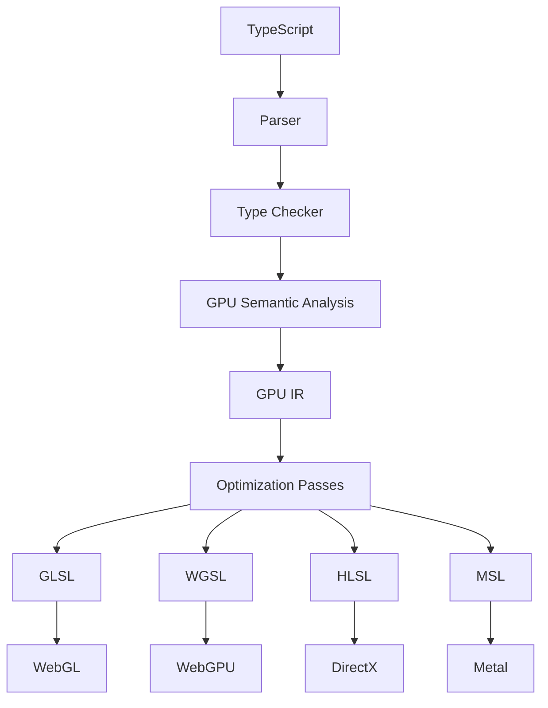

# BroMetal

Write TypeScript.  Lift Shaders.  Skip leg day.

BroMetal is LLVM-inspired compiler infrastructure for GPU programming that transforms TypeScript into highly optimized GPU shaders for WebGL, WebGPU, DirectX, and Metal.

