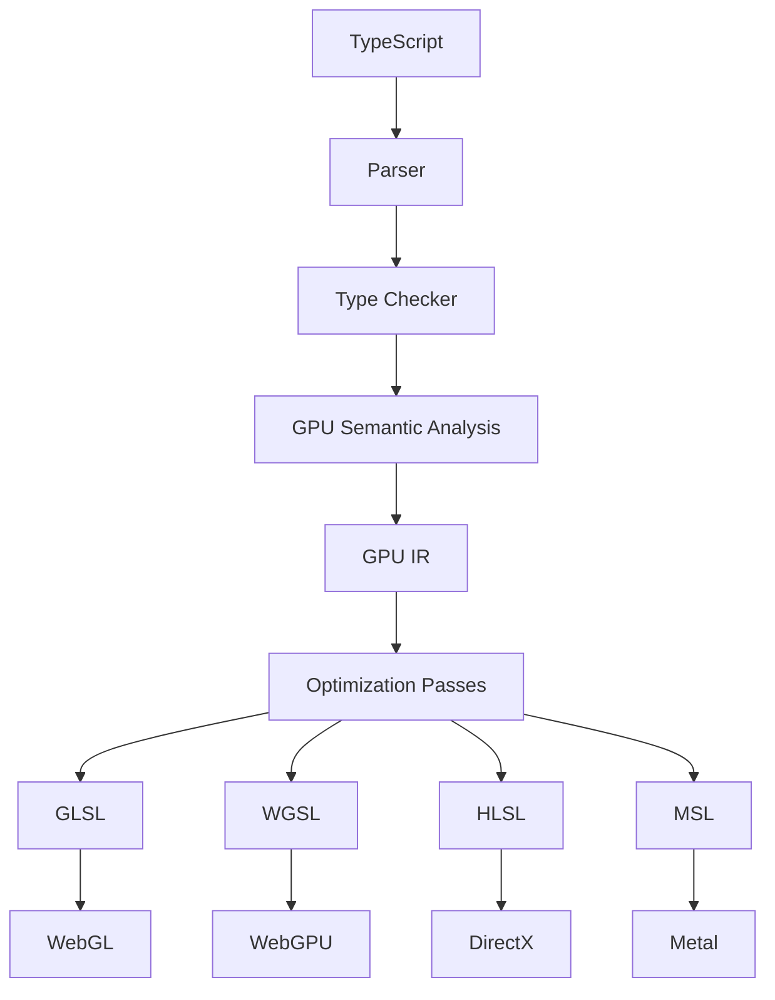

# BroMetal

Write TypeScript.  Lift Shaders.  Skip leg day.

BroMetal is an LLVM-inspired compiler that transforms TypeScript into highly optimized GPU shaders for WebGL and WebGPU. Write GPU code in TypeScript, compile to portable GLSL and WGSL, and eliminate shader boilerplate.

